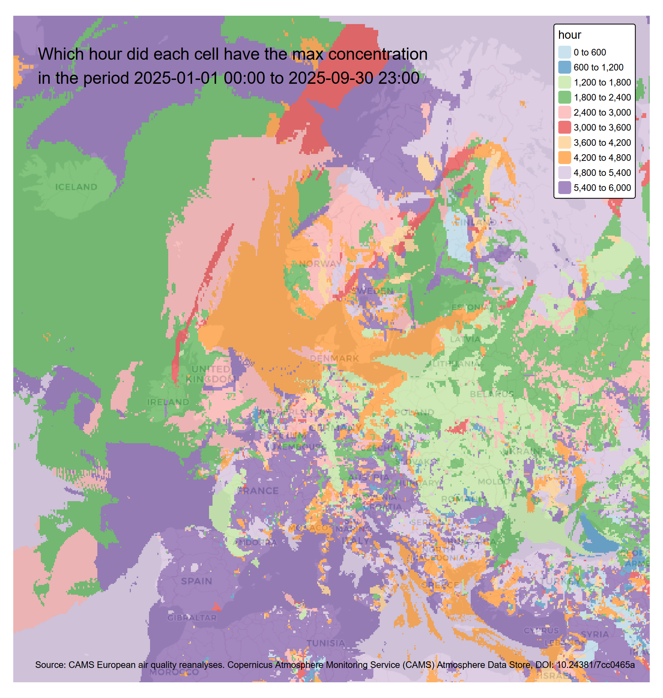

# Wildfire data from the ECMWF Atmosphere Data Store (ADS)

To reproduce/run for own dowmin, must [register (for free!) with
ecmwf](https://accounts.ecmwf.int/auth/realms/ecmwf/login-actions/registration?client_id=cds&tab_id=kWV0xKsufvs)
get the API key after registration Open 01_download.R and drop in the
API key, running the script will download netcdf (.nc files) to the data
folder 02_brick.R converts each one to raster bricks

03_plot.R stacks all the bricks

uses the function app in terra and base which.max to calculate the hour
when each cell experienced the highest concentration.

Plots a histogram of the frequencies from this

    |---------|---------|---------|---------|
    =========================================
                                              

Top 20 hours

| hour | count |
|-----:|------:|
| 2329 |   862 |
| 2369 |   805 |
| 5601 |   735 |
| 2370 |   688 |
| 5649 |   686 |
| 2368 |   648 |
| 5600 |   644 |
| 2425 |   632 |
| 5648 |   613 |
| 2381 |   601 |
| 2384 |   599 |
| 5603 |   589 |
| 2385 |   570 |
| 5602 |   553 |
| 2367 |   540 |
| 2383 |   539 |
| 2382 |   535 |
| 2380 |   528 |
| 2302 |   504 |
| 2366 |   501 |

Based on this can pick a period of interest.

And plot it as an animation

